1.1Hibernate框架的学习路线

		第一天：Hibernate的入门（Hibernate的环境搭建、Hibernate的API、Hibernate的CRUD）
		第二天：Hibernate的一级缓存、其他的API
		第三天：Hibernate的一对多配置、Hibernate的多对多的配置
		第四天：Hibernate的查询方式、抓取策略

1.2CRM的案例

1.2.1CRM的概述（了解）

1.2.1.1什么是CRM

1.2.1.2CRM有哪些模块

1.3Hibernate的框架的概述

1.3.1框架的概述

1.3.1.1什么是框架

	框架：指的是软件的半成品，已经完成了部分功能。

1.3.2EE的三层架构

1.3.2.1EE的经典三层结构
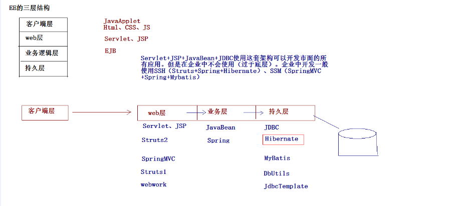

1.3.3Hibernate的概述
	
1.3.3.1什么是Hibernate

	Hibernate：Hibernate是一个持久层的ORM框架。

1.3.3.2什么是ORM
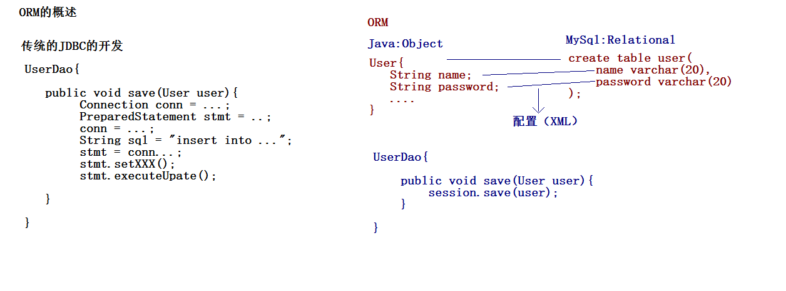

	ORM：Object Relational Mapping（对象关系映射）。指的是将一个Java中的对象与关系型数据库中的表建立一种映射关系，从而操作对象就可以操作数据库中的表。

1.3.3.3为什么要学习Hibernate

1.4Hibernate的入门

1.4.1Hibernate的入门

1.4.1.1下载Hibernate的开发环境

	Hibernate3.x  Hibernate4.x  Hibernate5.x

	https://sourceforge.net/projects/hibernate/files/hibernate-orm/5.0.7.Final/
1.4.1.2解压Hibernate

		documentation		:Hibernate开发的文档
		lib					:Hibernate开发包
		required			:Hibernate开发的必须的依赖包
		optional			:Hibernate开发的可选的jar包
		project				:Hibernate提供的项目

1.4.1.3创建一个项目，引入jar包

	数据库驱动包
	Hibernate开发的必须的jar包
	Hibernate引入日志记录包
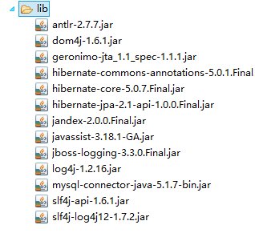
1.4.1.4创建表

	CREATE TABLE `cst_customer` (
	  `cust_id` bigint(32) NOT NULL AUTO_INCREMENT COMMENT '客户编号(主键)',
	  `cust_name` varchar(32) NOT NULL COMMENT '客户名称(公司名称)',
	  `cust_source` varchar(32) DEFAULT NULL COMMENT '客户信息来源',
	  `cust_industry` varchar(32) DEFAULT NULL COMMENT '客户所属行业',
	  `cust_level` varchar(32) DEFAULT NULL COMMENT '客户级别',
	  `cust_phone` varchar(64) DEFAULT NULL COMMENT '固定电话',
	  `cust_mobile` varchar(16) DEFAULT NULL COMMENT '移动电话',
	  PRIMARY KEY (`cust_id`)
	) ENGINE=InnoDB AUTO_INCREMENT=1 DEFAULT CHARSET=utf8;
1.4.1.5创建实体类
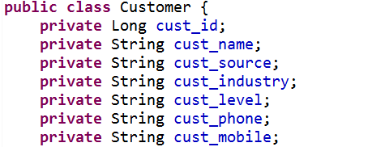
1.4.1.6创建映射（*****）

	映射需要通过XML的配置文件来完成，这个配置文件可以任意命名。尽量统一命名规范（类名.hbm.xml）
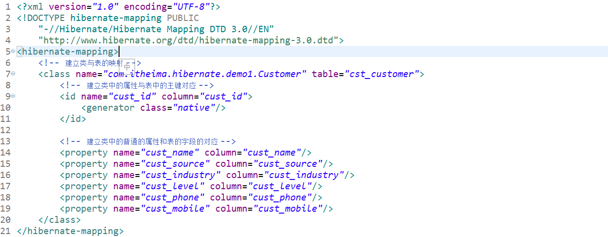
1.4.1.7创建一个Hibernate的核心配置文件（*****）
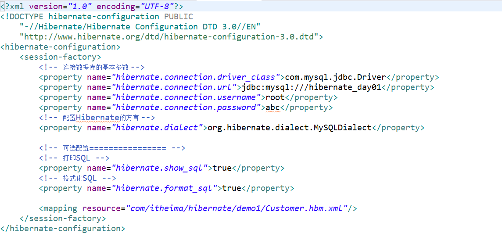
	Hibernate的核心配置文件的名称：hibernate.cfg.xml

1.4.1.8编写测试代码（*****）
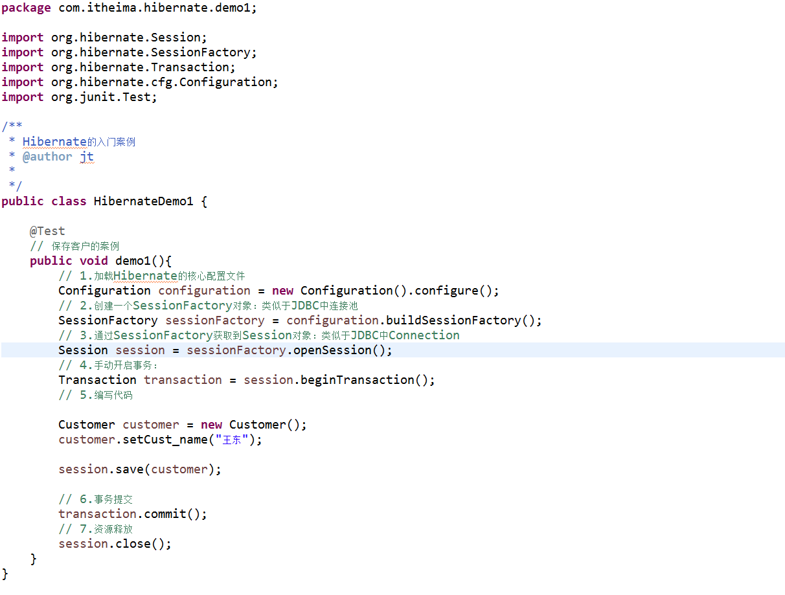
1.5Hibernate的常见配置

1.5.1XML提示的配置

1.5.1.1配置XML提示问题
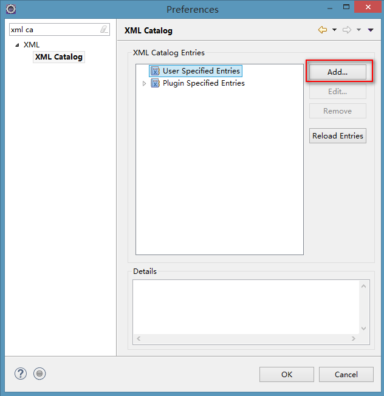
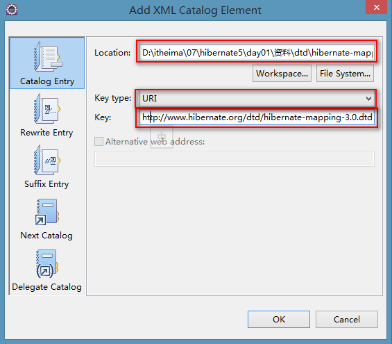
1.5.2Hibernate的映射的配置

1.5.2.1映射的配置

【class标签的配置】

标签用来建立类与表的映射关系
	属性：
	name		：类的全路径
	table		：表名（类名与表名一致，table可以省略）
	catalog		：数据库名
【id标签的配置】
	标签用来建立类中的属性与表中的主键的对应关系
	属性：
	name		：类中的属性名
	column		：表中的字段名（类中的属性名和表中的字段名如果一致，column可以省略）
	length		：长度
	type			：类型
【property标签的配置】

	标签用来建立类中的普通属性与表的字段的对应关系
	属性：
	name		：类中的属性名
	column		：表中的字段名
	length		：长度
	type			：类型
	not-null		：设置非空
	unique		：设置唯一

	1.5.3Hibernate的核心的配置

	1.5.3.1Hibernate的核心配置方式（了解）

	一种方式:属性文件的方式
	hibernate.properties
	hibernate.connection.driver_class=com.mysql.jdbc.Driver
	…
	hibernate.show_sql=true
	属性文件的方式不能引入映射文件（手动编写代码加载映射文件）

二种方式:XML文件的方式
	hibernate.cfg.xml
1.5.3.2核心的配置

	必须的配置
	连接数据库的基本的参数
	驱动类
	url路径
	用户名
	密码
	方言
	可选的配置
	显示SQL		：hibernate.show_sql
	格式化SQL	：hibernate.format_sql
	自动建表	：hibernate.hbm2ddl.auto
	none		：不使用hibernate的自动建表
	create		：如果数据库中已经有表，删除原有表，重新创建，如果没有表，新建表。（测试）
	create-drop	：如果数据库中已经有表，删除原有表，执行操作，删除这个表。如果没有表，新建一个，使用完了删除该表。（测试）
	update		：如果数据库中有表，使用原有表，如果没有表，创建新表（更新表结构）
	validate		：如果没有表，不会创建表。只会使用数据库中原有的表。（校验映射和表结构）。
映射文件的引入	
	引入映射文件的位置

1.6Hibernate的核心API

1.6.1Hibernate的API

1.6.1.1Configuration：Hibernate的配置对象

作用：
	加载核心配置文件
	hibernate.properties
	Configuration cfg = new Configuration();
	hibernate.cfg.xml
	Configuration cfg = new Configuration().configure();
加载映射文件
	// 手动加载映射
	configuration.addResource("com/itheima/hibernate/demo1/Customer.hbm.xml");
1.6.1.2SessionFactory：Session工厂
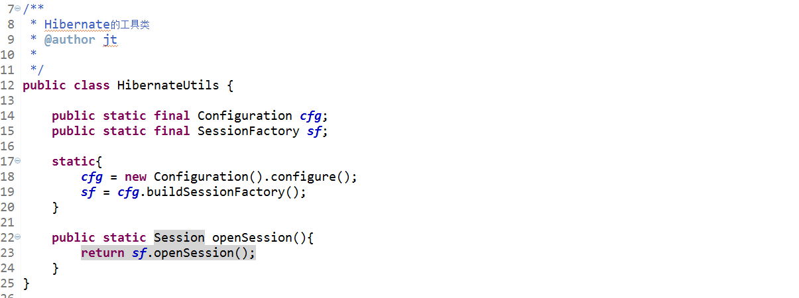
SessionFactory内部维护了Hibernate的连接池和Hibernate的二级缓存（不讲）。是线程安全的对象。一个项目创建一个对象即可。
配置连接池：（了解）
<!-- 配置C3P0连接池 -->
		<property name="connection.provider_class">org.hibernate.connection.C3P0ConnectionProvider</property>
		<!--在连接池中可用的数据库连接的最少数目 -->
		<property name="c3p0.min_size">5</property>
		<!--在连接池中所有数据库连接的最大数目  -->
		<property name="c3p0.max_size">20</property>
		<!--设定数据库连接的过期时间,以秒为单位,
		如果连接池中的某个数据库连接处于空闲状态的时间超过了timeout时间,就会从连接池中清除 -->
		<property name="c3p0.timeout">120</property>
		 <!--每3000秒检查所有连接池中的空闲连接 以秒为单位-->
		<property name="c3p0.idle_test_period">3000</property>
抽取工具类

1.6.1.3Session：类似Connection对象是连接对象
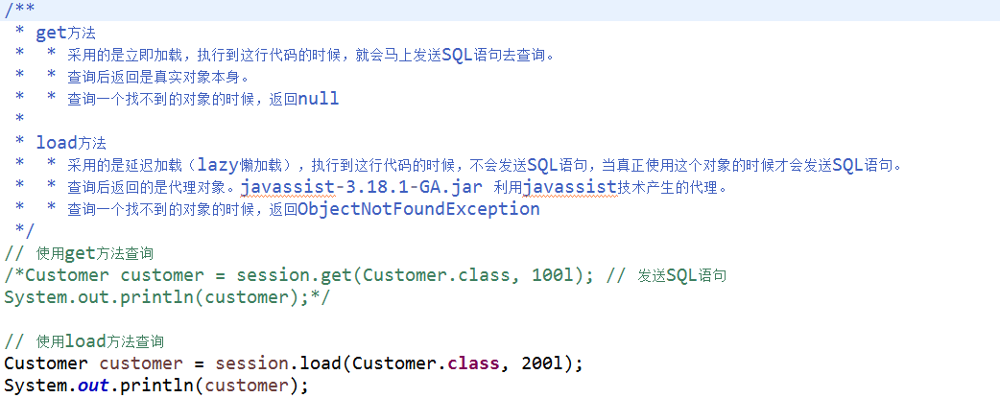
	Session代表的是Hibernate与数据库的链接对象。不是线程安全的。与数据库交互桥梁。

Session中的API

保存方法：

	Serializable save(Object obj);

查询方法：
	T get(Class c,Serializable id);
	T load(Class c,Serializable id);
	get方法和load方法的区别？
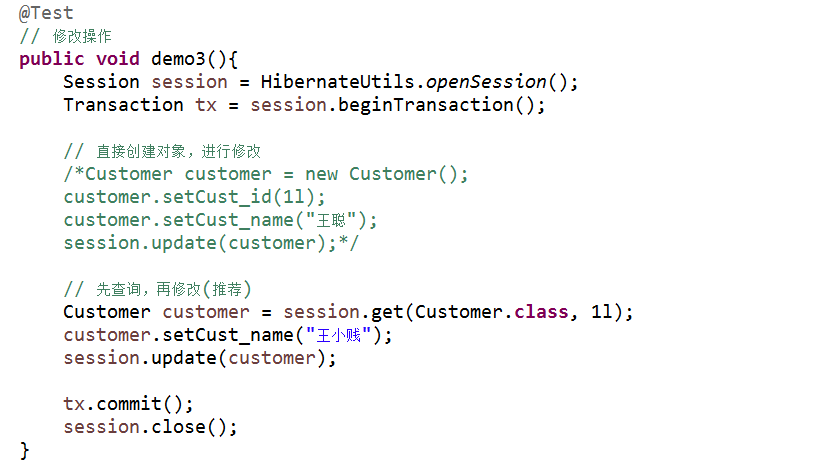
修改方法
	void update(Object obj);
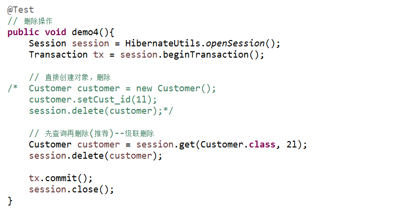
删除方法
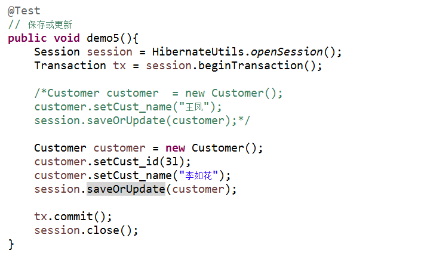
	void delete(Object obj);

保存或更新
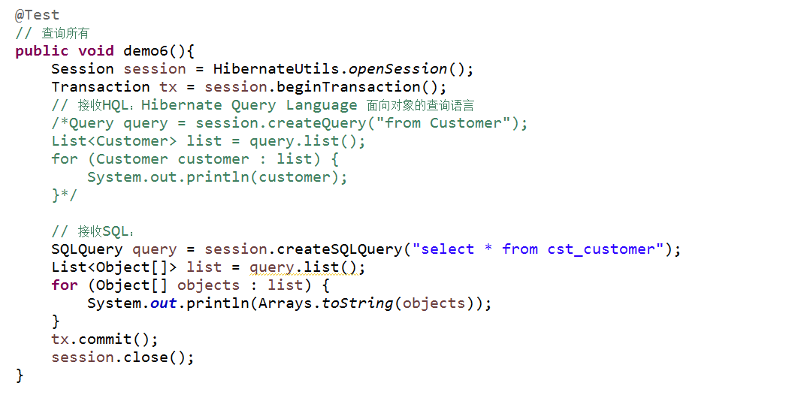
	void saveOrUpdate(Object obj)

查询所有

1.6.1.4Transaction：事务对象

	Hibernate中管理事务的对象。
	commit();
	rollback();
